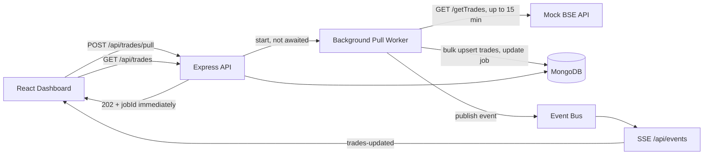

# BSE Trades Dashboard

A small full-stack project that shows how to handle a **very slow external API (up to 15 minutes)** behind a network that **kills any HTTP connection open for more than 30 seconds**.

> **Long-running external API → background job → MongoDB → real-time event (SSE) → dashboard update**

---

## 1. Project overview

- A **mock BSE API** returns ~3,000 seeded trades after a configurable delay (up to 15 minutes).
- An **Express backend** starts the pull in the background, stores trades in **MongoDB**, tracks each pull as a **Job**, and announces results over **Server-Sent Events (SSE)**.
- A **React dashboard** opens instantly with the trades already stored, lets you start a pull, and updates automatically when the pull finishes. No page refresh, no polling.

## 2. Problem statement

We pull trade data from the BSE Exchange API. A full pull can take up to **15 minutes**, but our network kills any HTTP connection open for more than **30 seconds**. The browser therefore must never wait on the pull, yet the dashboard must open immediately, show already-stored trades, and show new trades the moment a running pull completes, without refresh, polling, cron jobs or schedulers.

## 3. Architecture



More detail, a sequence diagram and the edge cases are in [`docs/architecture.md`](docs/architecture.md).

## 4. Why this solves the 30-second timeout problem

Every HTTP request the **browser** makes is short:

| Browser request | Duration |
|---|---|
| `GET /api/trades` (reads MongoDB only) | milliseconds |
| `POST /api/trades/pull` (creates a job, returns `202` + `jobId`) | milliseconds |
| `GET /api/trades/status` | milliseconds |

The slow 15-minute call is made by the **backend worker** to BSE, in the background, after the browser already has its answer. The result is saved in MongoDB, and the server then **pushes** a `trades-updated` event over an SSE stream that the dashboard opened earlier. The dashboard reacts by fetching the new data with one short request.

**Honest note:** an SSE stream is itself a long-lived connection. The design copes with that: `EventSource` reconnects automatically, the dashboard does one catch-up fetch on every (re)connect so it can never miss an update, and the server sends a tiny keep-alive comment every 20 s so idle proxies do not close the stream. That keep-alive carries no data and is not polling or a scheduler.

## 5. Technology stack

| Layer | Tech |
|---|---|
| Frontend | React 18, Vite, plain CSS, `EventSource` (SSE), `fetch` |
| Backend | Node.js 18+, Express 4, Axios, dotenv, cors |
| Database | MongoDB, Mongoose |
| Real time | Server-Sent Events |
| Tests | Jest, Supertest, mongodb-memory-server |

No Redis, Docker, Kafka or cloud services are needed.

## 6. Project structure

```
bse-trades-dashboard/
├── client/                    React + Vite dashboard
│   └── src/
│       ├── components/        Header, StatsGrid, StatCard, StatusBadge, PullControls, TradesTable
│       ├── pages/             DashboardPage
│       ├── hooks/             useTradeEvents (SSE), useDashboard (state + behaviour)
│       ├── services/          api.js (short-lived fetch calls)
│       └── utils/             format.js
├── server/                    Express API + background worker
│   ├── config/                env.js, db.js
│   ├── models/                Trade.js, Job.js
│   ├── services/              bseClient, tradeService, jobService, eventBus, sseHub
│   ├── workers/               pullWorker.js   <- the background job
│   ├── controllers/           tradeController, eventController
│   ├── routes/                tradeRoutes, eventRoutes, index
│   ├── utils/                 errors, asyncHandler, errorHandler, logger
│   ├── scripts/               seed.js
│   ├── tests/                 api.test.js, helpers.js
│   ├── app.js                 builds the Express app (importable by tests)
│   └── server.js              starts everything
├── mock-bse/                  Simulated BSE API (GET /getTrades)
│   ├── data/ routes/ tests/ server.js
├── docs/                      architecture.md, video-walkthrough.md, interview-questions.md
├── README.md  .gitignore  package.json
```

## 7. Prerequisites

- **Node.js 18 or newer** (`node -v`). The dev script uses `node --watch`.
- **MongoDB**, either:
  - installed locally and running on `localhost:27017`, **or**
  - a free **MongoDB Atlas** cluster (just put its connection string in `MONGODB_URI`).
- `npm` and `git`.

## 8. Installation

```bash
git clone <your-repo-url> bse-trades-dashboard
cd bse-trades-dashboard
npm run install:all
```

Create the three env files (Windows PowerShell: use `copy` instead of `cp`):

```bash
cp mock-bse/.env.example mock-bse/.env
cp server/.env.example server/.env
# client/.env is optional: the Vite dev server already proxies /api to the backend
```

## 9. Environment variables

`.env` files are git-ignored. Only `.env.example` files are committed.

**`mock-bse/.env`**

| Variable | Default | Meaning |
|---|---|---|
| `PORT` | `6000` | Mock BSE port |
| `BSE_DELAY_MS` | `15000` | How long `/getTrades` waits before answering. Use `900000` for 15 minutes. |

**`server/.env`**

| Variable | Default | Meaning |
|---|---|---|
| `PORT` | `5000` | API port |
| `MONGODB_URI` | `mongodb://localhost:27017/bse-trades` | MongoDB connection string |
| `BSE_API_URL` | `http://localhost:6000/getTrades` | Where the worker calls BSE |
| `BSE_REQUEST_TIMEOUT_MS` | `1200000` | How long the **backend** waits for BSE (20 min). Must be longer than the BSE delay. |
| `CLIENT_ORIGIN` | `http://localhost:5173` | Allowed CORS origin |

**`client/.env`** (optional): `VITE_API_URL` is only needed if the API is on another origin.

## 10. How to run the project

You need **four terminals** (one per long-running process), all from the project root. Details for each step follow in sections 11–14.

```bash
# Terminal 1: mock BSE
npm run mock

# Terminal 2: seed once, then start the backend
npm run seed --prefix server
npm run server

# Terminal 3: dashboard
npm run client
```

Open **http://localhost:5173**.

## 11. How to seed the database

Seeding stores the 3,000 mock trades so the dashboard has data on first load. The mock BSE must be running; the seed script forces its delay to 0.

```bash
npm run seed --prefix server
```

Safe to run repeatedly: trades are upserted by `tradeId`, so no duplicates are created. (You can also skip seeding and just click **Start Trade Pull**.)

## 12. How to start the mock BSE API

```bash
npm run mock
# Mock BSE API on :6000 (default delay 15000 ms)

curl "http://localhost:6000/getTrades?delayMs=0" | head -c 300
```

Query options on `GET /getTrades`: `?delayMs=N` overrides the delay for that request (capped at 900000), and `?fail=true` returns a 500 after the delay.

## 13. How to start the backend

```bash
npm run server        # auto-restarts on file changes
# or: npm start --prefix server
```

On startup the server connects to MongoDB (fails fast after 5 s if unreachable), builds the indexes, and marks any job left `running` by a previous crash as `failed`.

## 14. How to start the frontend

```bash
npm run client        # http://localhost:5173
npm run build --prefix client   # optional production build
```

## 15. API endpoints

| Method | Path | Description | Status codes |
|---|---|---|---|
| `GET` | `/getTrades` (mock BSE, :6000) | Seeded trades after the delay | 200, 500 |
| `GET` | `/api/trades` | Stored trades (newest first) + stats. Optional `?limit=N` | 200, 400, 503 |
| `POST` | `/api/trades/pull` | Start a background pull | **202**, 409, 503 |
| `GET` | `/api/trades/status` | `idle / pulling / completed / failed`, latest job, last successful pull | 200 |
| `GET` | `/api/jobs/:jobId` | One job | 200, 400, 404 |
| `GET` | `/api/events` | SSE stream | 200 (stream) |
| `GET` | `/api/health` | Health check | 200 |

**Start a pull** (returns immediately):

```json
{ "success": true, "message": "Trade pull started", "jobId": "job-6f1c0a9e-..." }
```

**Pull already running** (HTTP 409):

```json
{ "success": false, "message": "A trade pull is already in progress." }
```

**SSE events**

```text
event: pull-started
data: {"jobId":"job-...","startedAt":"2026-10-05T10:30:00.000Z"}

event: trades-updated
data: {"jobId":"job-...","count":3000,"fetched":3000}

event: pull-failed
data: {"jobId":"job-...","error":"BSE API timed out"}
```

## 16. How to test the 15-minute scenario

**Normal development (15 s delay)** needs no changes.

**Real 15-minute demo:**

1. Edit `mock-bse/.env`:
   ```env
   BSE_DELAY_MS=900000
   ```
2. Restart the mock (`Ctrl+C`, then `npm run mock`).
3. Prove the problem exists: a direct call dies at 30 s, just like the network would kill it.
   ```bash
   curl -m 30 -o /dev/null -w "%{http_code}\n" http://localhost:6000/getTrades
   # curl gives up after 30 s (prints 000)
   ```
4. In the dashboard click **Start Trade Pull**. The request returns in milliseconds with a `jobId`.
5. For the next ~15 minutes: reload the page, open another tab, search and sort. Stored trades stay visible and the status shows **Pulling**.
6. When BSE answers, all open tabs switch to **Completed** and the table updates on its own.

The backend waits up to 20 minutes for BSE (`BSE_REQUEST_TIMEOUT_MS`). To test failure handling, set `BSE_API_URL=http://localhost:6000/getTrades?fail=true` in `server/.env` and restart the backend.

## 17. How real-time updates work

1. When the dashboard loads, `useTradeEvents` opens **one** `EventSource` to `GET /api/events`. The server keeps that response open.
2. The server keeps every open response in a set (one per tab).
3. The worker finishes, saves trades, and publishes `trades-updated` on an in-process event bus.
4. The SSE hub writes `event: trades-updated` to **every** connected tab.
5. The `onTradesUpdated` handler in `useDashboard.js` calls `GET /api/trades` once and the table re-renders.
6. If the connection drops, `EventSource` reconnects by itself and the dashboard does one catch-up fetch. Nothing is missed.

The client code contains no `setInterval`, no `setTimeout` polling and no page reload.

## 18. Error handling

| Situation | Behaviour |
|---|---|
| BSE returns an error, times out, or is unreachable | Job → `failed` with a safe message (e.g. "BSE API timed out"), `pull-failed` event, dashboard shows the reason. Old trades stay visible. |
| BSE returns a malformed response | Job fails with "BSE API returned an invalid response" |
| Malformed trade records inside a response | Skipped; the rest are stored |
| Pull requested while one is running | `409` with a clear message (in-memory lock plus a MongoDB unique partial index) |
| MongoDB unavailable | API answers `503 Database temporarily unavailable`; startup fails fast |
| Invalid input (`?limit=abc`, bad job id, bad JSON) | `400`, unknown job `404`, unknown route `404` |
| Backend crashed mid-pull | On restart the stale `running` job is marked `failed` |
| SSE connection drops | Browser auto-reconnects; one catch-up fetch; header shows Disconnected meanwhile |
| Frontend cannot reach the API | Error state with a Retry button, or a banner if old data is on screen |

Clients only receive safe messages. Stack traces and internal details go to the server log only.

## 19. Design decisions

- **Background job in the backend, not the browser.** The only way a 15-minute call can coexist with a 30-second limit.
- **MongoDB as the source of truth.** The dashboard always opens with data, even during a pull.
- **SSE over WebSockets.** Updates flow only server → browser; SSE is plain HTTP, has built-in reconnect, and needs no library. Browser actions use normal `POST`/`GET`.
- **Small events, then fetch.** The event says "something changed"; the dashboard fetches data from the API. One source of truth, small payloads, and it works after a reconnect.
- **Upsert by `tradeId` + unique index.** Re-pulling never duplicates trades.
- **`202 Accepted` for the pull endpoint.** Accepted, not finished.
- **In-memory event bus.** Simple and sufficient for one server process.
- **Plain JavaScript and plain CSS.** Easy to read and explain.

## 20. Possible production improvements

- **BullMQ + Redis** for a durable job queue (survives restarts, retries, multiple workers).
- **Redis pub/sub** so SSE events reach clients connected to any server instance.
- **Authentication and authorization** on pulls and the SSE stream; **rate limiting**; `helmet`.
- **Server-side pagination, search and sorting** (and a virtualized table) for millions of trades; aggregation for stats.
- **Pull progress** events and a pull history view.
- **`Last-Event-ID` support** so SSE can replay missed events.
- **Structured logging, metrics and alerts** (pino, Prometheus).
- **Containerize and deploy** behind a reverse proxy with response buffering disabled for `/api/events`.
- If the real BSE offers an async or callback API, use it instead of one long request.

---

## Testing

```bash
npm test --prefix mock-bse     # mock BSE tests
npm test --prefix server       # backend tests (first run downloads a MongoDB binary, needs internet)
```

The server tests start an in-memory MongoDB, the real mock BSE and the real API, and cover: stored-trades endpoint, immediate `202` response, background storing, duplicate and simultaneous pulls, no duplicate trades on re-pull, failure handling, SSE delivery to multiple tabs, and input validation.

**Manual end-to-end check:** run the four terminals, open **two** browser tabs, click **Start Trade Pull** in one. Both tabs show *Pulling*; ~15 s later both show *Completed* and the new trades appear with no refresh. In DevTools → Network you will see the `events` request stay open (EventStream) and no repeating requests.

## Troubleshooting

| Symptom | Fix |
|---|---|
| `Startup failed: connect ECONNREFUSED ...27017` | MongoDB is not running, or fix `MONGODB_URI` |
| Header says **Disconnected** | Backend is not running or crashed |
| Pull fails with "Could not reach BSE API" | Start the mock (`npm run mock`) or check `BSE_API_URL` |
| `EADDRINUSE` | Another process uses the port; change `PORT` in the relevant `.env` |
| Server tests hang on first run | `mongodb-memory-server` is downloading MongoDB; wait or check your connection |

## Known limitations

- Designed for **one backend instance** (in-memory lock and startup recovery). The database unique index still blocks duplicate pulls across instances.
- No authentication or rate limiting (see section 20).
- If MongoDB goes down at the exact moment a pull completes, the job can stay `running` until the next restart or the 21-minute stale check.
