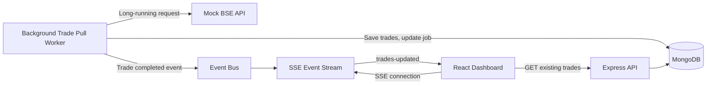
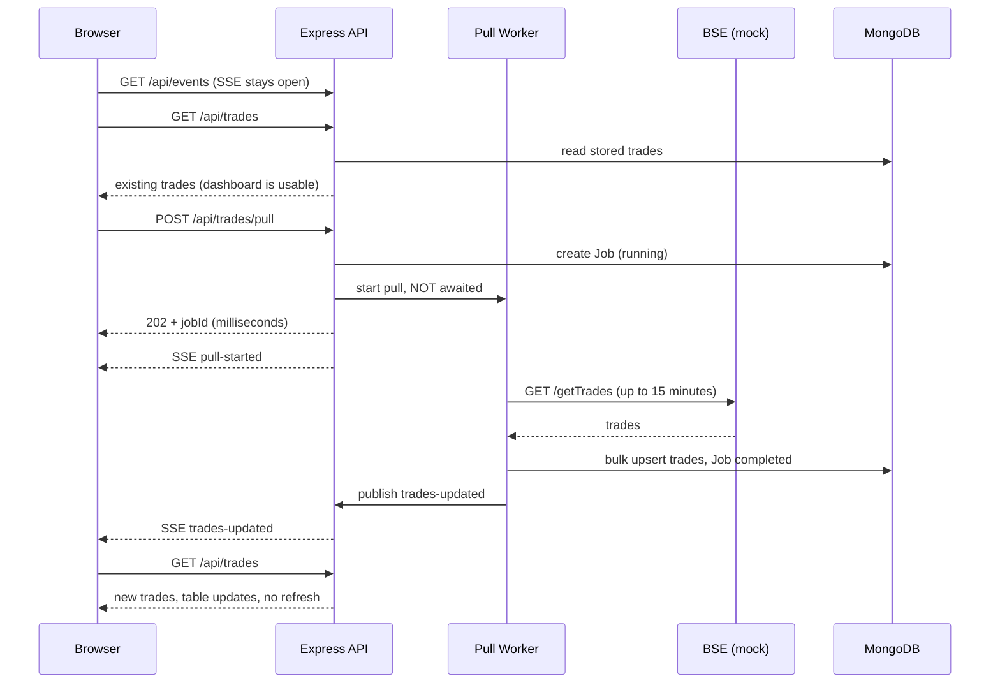

# Architecture

## 1. The problem in one paragraph

BSE can take up to **15 minutes** to return trades. The network kills any HTTP connection open for more than **30 seconds**. If the browser waited for BSE, the connection would be killed long before the answer arrived. So the browser must **never** be the one waiting.

## 2. Architecture diagram

## 3. Request flow: from "Start Trade Pull" to new trades on screen

Key point: the browser's `POST` is finished at step "202 + jobId". Everything after it happens on the server.

## 4. Components

| Component | File(s) | Responsibility |
|---|---|---|
| Mock BSE | `mock-bse/` | Returns 3,000 deterministic trades after `BSE_DELAY_MS` |
| Pull endpoint | `controllers/tradeController.js` | Starts a pull, answers `202` immediately |
| Background worker | `workers/pullWorker.js` | Calls BSE, stores trades, updates the Job, publishes events |
| BSE client | `services/bseClient.js` | Axios call with a long timeout; converts errors to safe messages |
| Trade service | `services/tradeService.js` | Chunked `bulkWrite` upserts, listing, stats |
| Job service | `services/jobService.js` | Status summary, stale-job recovery |
| Event bus | `services/eventBus.js` | In-process publish/subscribe; decouples worker from HTTP |
| SSE hub | `services/sseHub.js` | Tracks open dashboards, broadcasts events, keep-alive |
| Dashboard | `client/` | Loads stored data instantly, listens for events, refetches when told |

## 5. Data models

**Trade**: `tradeId` (**unique index**), `client`, `symbol`, `quantity`, `price`, `timestamp` (indexed, newest first).

**Job**: `jobId` (unique), `status` (`pending | running | completed | failed`), `startedAt`, `completedAt`, `tradeCount`, `error` (safe message only). A **partial unique index** allows only one `running` job at a time.

## 6. Events (server to browser)

| Event | Payload | Meaning |
|---|---|---|
| `pull-started` | `{jobId, startedAt}` | A pull began (all tabs show "Pulling") |
| `trades-updated` | `{jobId, count, fetched}` | Trades saved; `count` is the total now stored |
| `pull-failed` | `{jobId, error}` | The pull failed; `error` is a safe message |

## 7. Why these decisions

**Why not keep the browser request open?** The network terminates HTTP connections after 30 seconds while BSE may take 15 minutes. The request would be killed, the work lost, and retries would hit the same wall.

**Why background processing?** It separates the long operation from the user's HTTP request. The user gets an answer in milliseconds and the server finishes the work on its own time.

**Why MongoDB?** Persistent storage means previously fetched trades are available the moment the dashboard opens, even while a new pull is running. Upserts on a unique `tradeId` also prevent duplicates, and `bulkWrite` stores thousands of records efficiently.

**Why SSE?** The need is server-to-browser notification only. SSE is one-way, plain HTTP, reconnects automatically, and needs no extra library. It is separate from the BSE call: the dashboard simply stays connected while the backend works.

**Why not polling?** Polling creates a stream of repeated, mostly useless requests and is explicitly forbidden by the requirements. With SSE the server speaks only when something has happened.

**Why no cron or scheduler?** The pull happens when the user triggers it, not on a timer. (The 20 s keep-alive in the SSE hub is a connection keep-alive comment with no data; it does not pull anything.)

**Why not WebSockets?** The browser never needs to send messages over the live channel. WebSockets add an upgrade handshake and manual reconnect logic for no benefit here.

**Why send a small event and then fetch?** One source of truth (the API), small payloads, and it behaves identically after a reconnect.

## 8. Edge cases

| # | Case | Behaviour |
|---|---|---|
| 1 | Dashboard opened while a pull is running | Loads stored trades immediately; status shows "Pulling" |
| 2 | User starts a pull | `202` with `jobId` in milliseconds |
| 3 | Pull completes | Trades saved, job completed, `trades-updated` pushed |
| 4 | Multiple tabs open | All receive the event (the hub broadcasts to every open stream) |
| 5 | Pull fails | Job marked `failed`, `pull-failed` pushed, old trades remain visible |
| 6 | Pull started while one is running | `409 A trade pull is already in progress.` (in-memory lock + DB unique partial index) |
| 7 | BSE takes longer than 30 s | Fine: the wait happens in a backend background task, not a browser request |
| 8 | Backend restarts mid-pull | Job left `running` is marked `failed` at next startup |
| 9 | SSE connection drops | `EventSource` reconnects; one catch-up fetch on reconnect |
| 10 | Same trades pulled twice | Upsert by `tradeId`; no duplicates |

## 9. Honest caveat

An SSE stream is itself a long-lived HTTP connection. If a network truly kills every connection at 30 s, the stream would also be dropped. The design absorbs this: automatic reconnect, a catch-up fetch on every reconnect (so no update is lost), and a server keep-alive for idle proxies. Likewise, the 30-second rule is described for the browser connection; if the backend-to-BSE hop were also limited, the fix would be an asynchronous or callback API offered by BSE.

## 10. Scaling path

- **Durable jobs:** BullMQ + Redis (survive restarts, retries, many workers).
- **Many API instances:** Redis pub/sub in place of the in-process event bus, so every instance's SSE clients hear every event.
- **Large data:** server-side pagination, search and aggregation instead of sending all trades to the browser.
- **Security:** authentication, rate limiting, and a per-user pull policy.
